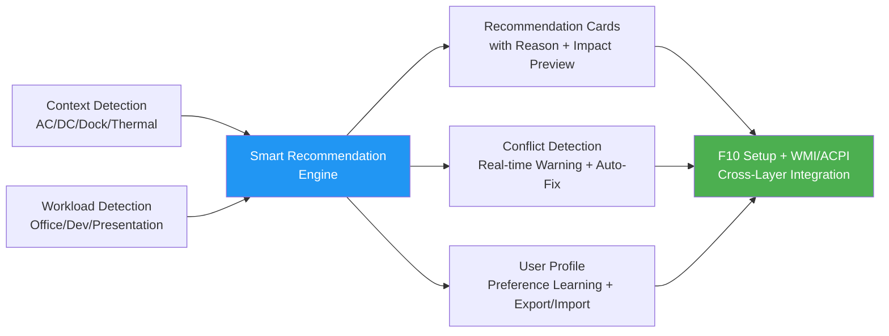
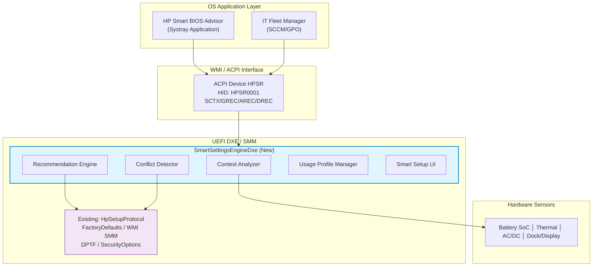
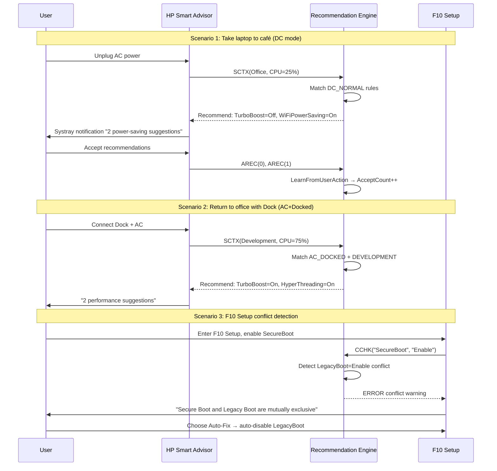

# Patent : BIOS Settings Smart Recommendation Engine (Simplified)

## Context-Aware BIOS Settings Smart Recommendation Engine

**Invention Field:** UEFI BIOS firmware settings management, user behavior analysis, cross-layer communication (WMI / ACPI)  

---

## 1. Technical Background and Problem

Existing UEFI BIOS settings systems have a fundamental flaw: **80+ settings are entirely static and unaware of user context**.

| Current Limitation | Description |
|-------------------|-------------|
| Static Factory Defaults | All same-model computers use identical factory defaults regardless of actual usage |
| Blind User Tuning | 80+ settings have implicit dependencies; ordinary users cannot comprehend |
| No Context Awareness | Settings don't auto-adjust based on "office + external display" vs. "café + battery" |
| Settings Conflict Blind Spot | Some setting combinations are mutually exclusive (e.g., TME + VT-x disabled) with no warning |
| No Feedback Learning | Users' painstaking tuning cannot be learned by the system; must start over on new machines |

Existing codebase already has a comprehensive settings infrastructure but lacks a smart recommendation layer:

```
HpCoreMirror/HpCoreSetup/
├── HpSetupConfigurations.h   ← 16+ config structures (SYSTEM_OPTIONS_VARIABLE 32 fields, etc.)
├── HpSetupDxe.inf            ← Setup main driver
└── FactoryDefaultsProtocol   ← 17+ modules register defaults

WMI / ACPI Interface:
├── Public WMI (754-line MOF, 19+ SEQ_IDs)
├── GHPS() read / SHPS() write / GORD() boot order
└── SMM Handler → NVRAM Variable Store

Settings Distribution:
├── POWER_MANAGEMENT_OPTIONS   ← TurboBoost, DPTF, ModernStandby
├── SECURITY_OPTIONS           ← SecureBoot, TPM, DeviceGuard
├── DEVICE_OPTIONS_VARIABLE    ← USB, Thunderbolt
├── WirelessSetupVariable      ← WiFi, BT, WWAN
└── GfxSetupVariable           ← GPU, Display
```

**Core Problem:** The settings access capabilities (HII + WMI + ACPI + SMM) are fully in place, yet lack a context-aware smart recommendation engine to leverage them.

---

## 2. Invention Summary

This invention adds a **Context-Aware Smart Recommendation Engine** on top of the existing BIOS settings infrastructure:



**Core Innovation:** Context → Rule matching → Recommendations (with confidence + rationale + impact preview) → Conflict detection → Preference learning feedback loop.

---

## 3. System Architecture



---

## 4. Context Analysis and Recommendation Engine

### 4.1 Context Data Structures

```c
typedef enum {
  POWER_STATE_AC_DOCKED     = 0,  // AC + Dock station
  POWER_STATE_AC_STANDALONE = 1,  // AC standalone
  POWER_STATE_DC_NORMAL     = 2,  // Battery >30%
  POWER_STATE_DC_LOW        = 3,  // Battery ≤30%
  POWER_STATE_DC_CRITICAL   = 4,  // Battery ≤10%
} POWER_STATE;

typedef enum {
  WORKLOAD_IDLE         = 0,  // Idle
  WORKLOAD_OFFICE       = 1,  // Office
  WORKLOAD_MULTIMEDIA   = 2,  // Multimedia
  WORKLOAD_DEVELOPMENT  = 3,  // Development
  WORKLOAD_COMPUTE      = 4,  // HPC
  WORKLOAD_PRESENTATION = 5,  // Presentation
} WORKLOAD_TYPE;

typedef enum {
  THERMAL_COOL     = 0,  // <55°C
  THERMAL_WARM     = 1,  // 55-75°C
  THERMAL_HOT      = 2,  // 75-90°C
  THERMAL_CRITICAL = 3,  // >90°C
} THERMAL_STATE;

// Complete usage context snapshot
typedef struct {
  POWER_STATE     PowerState;
  UINT8           BatteryPercent;        // 0-100
  BOOLEAN         IsACConnected;
  BOOLEAN         IsDocked;
  BOOLEAN         ExternalDisplayConnected;
  UINT8           ExternalDisplayCount;
  WORKLOAD_TYPE   DetectedWorkload;
  UINT8           CpuUtilizationAvg;     // 5-minute average
  THERMAL_STATE   ThermalState;
  UINT16          CpuTempCelsius;        // ×10 precision
  FORM_FACTOR_TYPE FormFactor;           // NB/DT/AIO/WS/Convertible
  BOOLEAN         HasDGpu;
  EFI_TIME        Timestamp;
} USAGE_CONTEXT;
```

### 4.2 Recommendation Rule Knowledge Base

Each rule defines: **under what context, change what setting to what value, with rationale and impact**.

```c
typedef struct {
  POWER_STATE   RequiredPowerState;    // 0xFF = any
  WORKLOAD_TYPE RequiredWorkload;      // 0xFF = any
  THERMAL_STATE RequiredThermal;       // 0xFF = any
  CHAR16        TargetSetting[64];
  CHAR16        RecommendedValue[32];
  UINT8         ConfidenceBase;        // 0-100
  UINT16        ImpactFlags;           // PERFORMANCE_UP | BATTERY_LIFE_UP | SECURITY_UP | BOOT_SPEED_UP ...
  CHAR16        ReasonTemplate[128];
} CONTEXT_RULE;
```

**Selected Rule Examples:**

| Context | Setting | Recommended | Conf. | Impact | Rationale |
|---------|---------|-------------|-------|--------|-----------|
| DC Low + NB | TurboBoost | Disable | 85% | ⬆️Battery ⬇️Perf | Low battery — disabling Turbo extends ~20 min |
| DC Low + NB | WiFiPowerSaving | Enable | 80% | ⬆️Battery | WiFi power saving reduces wireless draw ~15% |
| AC Docked + Dev | TurboBoost | Enable | 90% | ⬆️Perf | AC + Dock + cool thermals, maximize compile speed |
| AC Docked + Pres | FanMode | Quiet | 75% | ⬇️Perf | Presentation detected — quiet fan reduces meeting noise |
| Any (TPM hw) | TpmDevice | Available | 95% | ⬆️Security | TPM hardware present but disabled; required for BitLocker |
| Any | SecureBoot | Enable | 95% | ⬆️Security | Secure Boot protects against boot-level malware |
| Hot thermal | ThermalProfile | Cool | 90% | ⬇️Perf ⬆️Battery | High temp — Cool profile reduces temperature and noise |
| Office | FastBoot | Enable | 75% | ⬆️Boot | Office workload — Fast Boot reduces ~3 sec startup |
| Any | NetworkBoot | Disable | 70% | ⬆️Boot ⬆️Security | PXE rarely used; disabling speeds up boot |

### 4.3 Recommendation Generation Algorithm

```c
EFI_STATUS
GenerateRecommendations (
  IN  USAGE_CONTEXT          *Context,
  IN  USER_PROFILE           *Profile,     // User preferences (optional)
  OUT RECOMMENDATION_REPORT  *Report
  )
{
  for (UINTN i = 0; i < KNOWLEDGE_BASE_COUNT; i++) {
    CONTEXT_RULE *Rule = &gKnowledgeBase[i];

    // Context matching (PowerState / Workload / Thermal / FormFactor)
    if (!MatchesContext (Rule, Context)) continue;

    // Hardware prerequisite check
    if (Rule->RequiresHardware && !CheckHardwareCapability (Context, Rule->HardwareCapBits)) continue;

    // Only recommend items where current value ≠ recommended value
    GetCurrentSettingValue (Rule->TargetSetting, CurrentValue, sizeof(CurrentValue));
    if (StrCmp (CurrentValue, Rule->RecommendedValue) == 0) continue;

    // Build recommendation + dynamically fill reason text
    BuildRecommendation (Rec, Rule, Context);

    // Adjust confidence based on user history
    // Accepted → +10, Rejected → -15, Manually set to recommended → +20
    if (Profile != NULL) AdjustConfidenceByHistory (Rec, Profile);
  }

  SortRecommendationsByPriority (Report);
  Report->OverallOptimizationScore = CalculateOptimizationScore (Context, Report);
  return EFI_SUCCESS;
}
```

---

## 5. Conflict Detection and User Profile

### 5.1 Conflict Rules

Before applying any setting change or recommendation, check for mutually exclusive combinations.

```c
typedef struct {
  CHAR16             SettingA[64];
  CHAR16             ValueA[32];
  CHAR16             SettingB[64];
  CHAR16             ValueB[32];
  CONFLICT_SEVERITY  Severity;      // INFO / WARNING / ERROR
  CHAR16             Description[256];
  CHAR16             Resolution[256];
} CONFLICT_RULE;
```

**Pre-built Conflict Rules:**

| Setting A | Value A | Setting B | Value B | Severity | Description |
|-----------|---------|-----------|---------|----------|-------------|
| TotalMemoryEncryption | Enable | VirtualizationTechnology | Disable | ERROR | TME requires VT-x |
| SecureBoot | Enable | LegacyBoot | Enable | ERROR | Secure Boot and Legacy Boot are mutually exclusive |
| DeviceGuard | Enable | SecureBoot | Disable | ERROR | Device Guard requires Secure Boot |
| FastBoot | Enable | UsbBoot | Enable | WARNING | Fast Boot may skip USB initialization |
| WakeOnLAN | Enable | BatterySaver | Enable | WARNING | WoL keeps NIC powered, conflicts with battery saving |
| ThunderboltSecurity | None | DmaProtection | Enable | WARNING | TB no security + DMA protection contradiction |
| TurboBoost | Enable | HyperThreading | Disable | INFO | Multi-thread benefit reduced |

Conflict checking can be invoked at three points: (1) real-time F10 changes, (2) pre-apply recommendation check, (3) full boot-time scan.

### 5.2 User Profile

Persistently records user acceptance/rejection history of recommendations, supporting cross-device migration.

```c
typedef struct {
  UINT32   Signature;    // 'UPRF'
  UINT16   Version;

  // Setting preference history
  UINT8    HistoryCount;
  struct {
    CHAR16   SettingName[64];
    UINT8    AcceptCount;
    UINT8    RejectCount;
    BOOLEAN  ManualSetToRecommended;
    CHAR16   PreferredValue[32];
  } History[MAX_SETTING_HISTORY_ENTRIES];  // Up to 40 entries

  // Common context snapshots
  UINT8    SnapshotCount;
  struct {
    POWER_STATE   TypicalPowerState;
    WORKLOAD_TYPE TypicalWorkload;
    UINT16        OccurrenceCount;
  } Snapshots[10];

  // Inferred preferences
  BOOLEAN  PreferPerformance;
  BOOLEAN  PreferBatteryLife;
  BOOLEAN  PreferSecurity;
  BOOLEAN  PreferSilence;

  // Statistics
  UINT16   TotalRecommendationsAccepted;
  UINT16   TotalRecommendationsRejected;
} USER_PROFILE;
```

**Preference Inference Logic:** From accumulated accept/reject history and common context statistics, the system automatically infers whether the user is performance-oriented, battery-oriented, security-oriented, or silence-oriented, and dynamically adjusts subsequent recommendation confidence accordingly.

---

## 6. Smart Settings UI and ACPI Communication

### 6.1 F10 Setup Recommendation Dashboard

```
┌───────────────────────────────────────────────────────┐
│ F10 Setup → Smart Settings Advisor                     │
├───────────────────────────────────────────────────────┤
│ Optimization Score: 72/100  ████████████░░░░░░░       │
│ Context: 🔋 DC 65% │ 💻 Office │ 🌡️ Cool │ No Dock   │
├───────────────────────────────────────────────────────┤
│ [HIGH] 🔒 SecureBoot: Disabled → Enabled  95%         │
│   "Protects against boot-level malware"               │
│   [Enter-Apply] [D-Details] [X-Dismiss]               │
├───────────────────────────────────────────────────────┤
│ [MED]  ⚡ TurboBoost: Enabled → Disabled  85%         │
│   "Battery 65%. Disable extends ~20 min"              │
│   [Enter-Apply] [D-Details] [X-Dismiss]               │
├───────────────────────────────────────────────────────┤
│ [LOW]  🌐 NetworkBoot: Enabled → Disabled  70%        │
│   "PXE rarely used. Disabling speeds boot"            │
├───────────────────────────────────────────────────────┤
│ F5-Apply All │ F6-Profile │ F7-Export │ ⚠ Conflicts:0 │
└───────────────────────────────────────────────────────┘
```

Features include: recommendation cards (priority-sorted), real-time conflict warning dialogs, and an impact preview panel (four-dimensional quantitative prediction across performance / battery life / security / boot speed).

### 6.2 ACPI/WMI Interface

```asl
// SmartSettings.asl — ACPI Device HPSR0001

Device (HPSR) {
  Name (_HID, "HPSR0001")
  Method (SCTX, 2) {}  // Set Context — OS reports Workload + CPU%
  Method (GREC, 0) {}  // Get Recommendations — retrieve recommendation report
  Method (AREC, 1) {}  // Apply Recommendation — apply by index
  Method (DREC, 1) {}  // Dismiss Recommendation — reject for learning
  Method (GPRF, 0) {}  // Get Profile — retrieve user profile summary
  Method (CCHK, 2) {}  // Conflict Check — check conflicts (setting, value)
  Method (XPRF, 0) {}  // Export Profile — export profile
  Method (IPRF, 1) {}  // Import Profile — import profile
}
```

**OS-Side Integration:** HP Smart BIOS Advisor (systray application) detects CPU/GPU utilization every 5 minutes → calls SCTX to report → GREC to get recommendations → displays notification. IT administrators can deploy recommendation profiles at scale via SCCM/GPO.

---

## 7. New Modules and NVRAM Plan

### 7.1 New Modules

| Module | Type | Path |
|--------|------|------|
| SmartSettingsEngineDxe | DXE_DRIVER | `HpFeature/HpSmartSettings/PubSrcPkg/SmartSettingsEngineDxe/` |
| SmartSettingsEngineSmm | DXE_SMM_DRIVER | `HpFeature/HpSmartSettings/PubSrcPkg/SmartSettingsEngineSmm/` |
| SmartSettingsSetupDxe | DXE_DRIVER | `HpFeature/HpSmartSettings/PubSrcPkg/SmartSettingsSetupDxe/` |
| SmartSettingsAcpiTables | USER_DEFINED | `HpFeature/HpSmartSettings/PubSrcPkg/AcpiTables/` |

**New Libraries:** ContextAnalyzerLib, RecommendationEngineLib, ConflictDetectorLib, UserProfileLib, SettingsKnowledgeBaseLib

**Modified Existing Modules:** HpSetupDxe (add Smart Advisor entry), FactoryDefaultsProtocol (register SmartSettings defaults), WmiSmmHandler (add SEQ_ID), Setup VFR forms (recommendation indicator icon ★)

### 7.2 NVRAM Variables

| Variable | GUID | Size | Description |
|----------|------|------|-------------|
| SmartRecReport | gHpSmartSettingsVarGuid | ~2,400B | Latest recommendation report |
| SmartUserProfile | gHpSmartSettingsVarGuid | ~3,200B | User profile |
| SmartContextCache | gHpSmartSettingsVarGuid | ~128B | Context snapshot cache |
| SmartConflictCache | gHpSmartSettingsVarGuid | ~512B | Conflict cache |

**Total NVRAM Footprint: ~6.2 KB**

---

## 8. Application Scenarios



---

## 9. Patent Claims

**Independent Claim 1:** A context-aware BIOS settings smart recommendation method comprising:
(a) detecting the computing device's current usage context (power state, peripherals, workload type, thermal state);
(b) matching applicable settings optimization rules from a knowledge base based on detected context;
(c) comparing recommended values with current values, generating recommendations only for differing items with confidence scores, rationale, and impact preview;
(d) presenting recommendations via a visual interface in BIOS Setup including recommendation cards, impact indicators, and an overall optimization score.

**Independent Claim 2:** The method of Claim 1, further comprising real-time conflict detection: before applying any setting change or recommendation, checking for mutually exclusive combinations, displaying conflict descriptions, suggested resolutions, and a one-click auto-fix option.

**Independent Claim 3:** The method of Claim 1, further comprising user profile management: persisting acceptance/rejection history → preference inference (performance/battery/security/silence) → dynamically adjusting confidence scores.

**Dependent Claim 4:** The method of Claim 3, wherein confidence is adjusted based on historical behavior: acceptance +10, rejection −15, manually set to recommended value +20.

**Dependent Claim 5:** The method of Claim 1, wherein workload detection includes the OS periodically reporting CPU/GPU utilization via ACPI, with the firmware classifying workloads as office, multimedia, development, HPC, or presentation mode.

**Dependent Claim 6:** The method of Claim 1, further comprising impact preview: predicting the post-change effects using four-dimensional quantitative metrics (performance, battery life, security, boot speed), displayed as progress bar graphics.

**Dependent Claim 7:** The method of Claim 3, wherein the user profile supports export to external storage and import on another same-model computing device for cross-device settings migration.

**Dependent Claim 8:** A system comprising a processor and UEFI firmware configured to implement the method of any one of Claims 1-7, including a context analyzer, recommendation engine, conflict detector, profile manager, NVRAM persistent storage, BIOS Setup recommendation UI, and ACPI/WMI interface layer.


